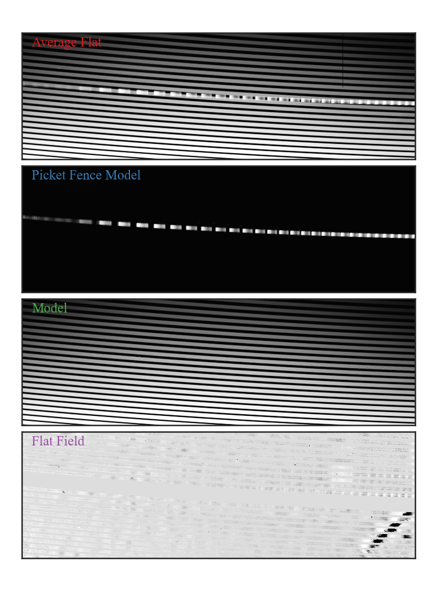

# The Robert G. Tull Coudé Spectrograph Data Reduction Pipeline

## Overview
The Tull Spectrograph Data Reduction Pipeline (TSDRP) is designed to process spectral data from the Tull Coudé Echelle Spectrograph. It offers functionalities like spectral extraction, bias subtraction, flat-field correction, wavelength calibration, cosmic ray rejection, and full aperture extraction. The pipeline allows users to reduce one night of data at a time and organizes reduction products with the calibration products created. Additionally, users can customize processing with command-line options. This pipeline currently works for the following setups:

- TS23

## Installation
```bash
git clone https://github.com/grzeimann/TSP.git
```

### Prerequisites
Ensure you have the following installed:
- Python 3.x
- Numpy v1.24+
- Scipy v1.11+
- Astropy v5.3+
- Matplotlib v3.7+
- Scikit-image v0.20+
- Seaborn v0.12+
- Required libraries (listed below)

### Required Libraries
```bash
pip install numpy scipy matplotlib astropy scikit-image seaborn
```


### Optional Libraries (Suggested)
To fill in masked values we use Pieter van Dokkum's maskfill.  The description can be found in van Dokkum & Pasha (2024) (PASP).
```bash
pip install maskfill
```

## Usage
```python
usage: python reduction.py [-h] [-ea EXTRACTION_APERTURE] [-fae] [-fw] [-drc]
                    [-dcn] [-bl BIAS_LABEL] [-al ARC_LABEL] [-fl FLAT_LABEL]
                    folder rootdir

positional arguments:
  folder                folder for reduction
  rootdir               base directory for raw data

options:
  -h, --help            show this help message and exit
  -ea EXTRACTION_APERTURE, --extraction_aperture EXTRACTION_APERTURE
                        Pixel aperture in "rows" used for extraction
                        (default=11)
  -fae, --full_aperture_extraction
                        Extract the full aperture for each spectrum
  -fw, --fit_wave       Fit the wavelength solution
  -drc, --dont_reject_cosmics
                        Do not reject cosmic rays
  -dcn, --dont_cont_normalize
                        Do not continuum normalize
  -bl BIAS_LABEL, --bias_label BIAS_LABEL
                        The objet name for bias files (default: "bias")
  -al ARC_LABEL, --arc_label ARC_LABEL
                        The objet name for arc files (default: "ThAr")
  -fl FLAT_LABEL, --flat_label FLAT_LABEL
                        The objet name for flat files (default: "FF")
```

### Examples
For reductions, it’s best to process one night at a time. The code works within a directory structure rooted in a base folder (rootdir). See the example below.
```bash
/rootdir
/rootdir/night1
/rootdir/night2
/rootdir/night3
```

For the example above, you could reduce one night at a time like:
```bash
python WHEREVER/TSDRP/reduction.py night1 rootdir
python WHEREVER/TSDRP/reduction.py night2 rootdir
python WHEREVER/TSDRP/reduction.py night3 rootdir
```

The reductions will then be placed here:
```bash
/rootdir/night1/reduce/arc_image.fits
/rootdir/night1/reduce/bias_image.fits
/rootdir/night1/reduce/blaze_spectra.fits
/rootdir/night1/reduce/ff_image.fits
/rootdir/night1/reduce/ff_model.fits
/rootdir/night1/reduce/mask_image.fits
/rootdir/night1/reduce/trace_image.fits
/rootdir/night1/reduce/wave_offset_1D.png
/rootdir/night1/reduce/wave_offset_2D.png
/rootdir/night1/reduce/FILENAME1_reduced.fits
/rootdir/night1/reduce/trace_offset_FILENAME1_residual.png
```

Calibration products from the night are stored in the 'reduce' folder. This folder also contains visualizations of wavelength offsets from the archive solution, trace offsets for each science frame, and the final science reduction products.

### Product Descriptions

This code generates a multi-frame FITS file in the "reduce" folder. This file includes various data frames: the original image, the cleaned (bias-subtracted, bad pixel filled) image, the error frame, the binary mask, the spectra for each order, the error associated with each order, and the wavelength calibration for each order. Additionally, the file contains combined data, including the flattened (or merged) wavelength solution, spectrum, and associated errors. If the full_aperture_extraction flag is enabled, the complete spectra for each aperture and their corresponding errors are also appended to the file.


## Key Tasks

1. **Configuration Values**
   - The code defines several command-line argument options for configuring spectrum extraction and data processing. The folder argument specifies the folder for reduction and is required, accepting a string value. Similarly, the rootdir argument, also required and a string, designates the base directory for raw data. For customizing the extraction aperture size, the -ea or --extraction_aperture argument takes an integer with a default value of 11.  Another option, -fae or --full_aperture_extraction, returns the full aperture of the spectrum interpolated to a uniform grid rather than collapsing it into a 1D array for each order. For wavelength solution fitting, -fw or --fit_wave can be applied. Lastly, the -cr or --cosmic_rejection option provides cosmic rejection during wavelength fitting. Together, these options allow for detailed control over data processing and spectrum extraction within the specified directory and folder structure.

```python
# =============================================================================
# Configuration values
# =============================================================================
Ncols = 2048  # Number of columns in the detector (pixels)
Nrows = 2048  # Number of rows in the detector (pixels)
Bias_section_size = 32  # Width of the overscan region (pixels) used for bias correction
gain = 0.584  # Conversion factor from electrons to ADU (Analog-to-Digital Units)
readnoise = 3.06  # Read noise of the detector in electrons (e-)
fiber_model_thresh = 250  # Threshold for fiber model fitting (arbitrary units)
trace_order = 4  # Polynomial order used for tracing the fiber paths
trace_ncolumns = 250  # Number of columns used for fiber tracing
flat_line_list = [  # Wavelengths (in Ångströms) of emission lines in the flat-field
    3679.9, 3705.6, 3719.9, 3722.6, 3733.3, 3734.9, 3737.1,
    3745.6, 3748.3, 3820.5, 3824.4, 3856.4, 3859.9, 3878.6,
    3886.3, 3899.7, 3922.9, 3927.9, 3930.3, 3944.1, 3961.6,
    5890.04, 5896.0
]
flat_line_window = 0.65  # Tolerance (in Ångströms) for modeling flat-field emission lines

```

2. **Master Bias Frame**
   - The build_master_bias function creates a master bias image by biweight averaging multiple bias frames while subtracting overscan values from a overscan region of each image. The function takes in a list of file paths to bias images (bias_files), the number of rows (Nrows), columns (Ncols), and the size of the overscan section to exclude (Bias_section_size). The function loads each image, removes the bias calculated from the specified section, and retains only the relevant columns. It then computes the average bias image using a robust biweight averaging method and trims the edges. The result is a 2D array (avg_bias) representing the cleaned and averaged master bias image.

   - The master bias frame is saved as a FITS file (bias_image.fits).

4. **Master Flat Frame**
   - The build_master_ff function generates a master flat-field image by averaging multiple flat-field frames, after subtracting a master bias and removing a designated bias section. It takes as inputs a list of flat-field file paths (ff_files), the number of rows (Nrows), columns (Ncols), the size of the bias section to exclude (Bias_section_size), and the precomputed master bias image (avg_bias). Each flat-field image is loaded, the bias is removed from the specified section, and only the relevant columns are retained. The images are then edge-trimmed, the master bias is subtracted, and the function uses robust biweight averaging to create the final master flat-field image (avg_ff).
  
   - The master flat frame is saved as a FITS file (ff_image.fits).

5. **Mask Frame Creation**
   - The make_mask function generates a binary mask for an input image, marking specified columns and an optional "picket fence" region for exclusion, based on given height and bias parameters.
   - The mask frame is saved as a FITS file (mask_image.fits).

6. **Trace Measurement**
   - The get_trace function computes the trace for each fiber in the input image by detecting fiber peaks in column chunks and aligning them based on a reference peak pattern. It uses convolution and biweight filtering to enhance and locate peaks, then refines the peak alignment by fitting a polynomial model. Finally, it outputs a full trace across all columns, along with the trace data per chunk and the averaged x-coordinates.
   - The trace information is saved as a FITS file (trace_image.fits).
<p align="center">
  
</p>

7. **Scattered Light**
   - There are two functions that can calculate the scattered light in a frame
   - The *spline_background* function estimates the background of a 2D image by iteratively fitting splines to the pixel data. The function processes the a masked image (order traces are masked with a specified width) column-wise by isolating each column's pixel values, identifying valid (non-zero) data points, and fitting a 1D spline model to these points. The spline fitting process involves removing outliers—data points significantly deviating from the fitted spline and refining the fit using updated knot positions. The refined fit is stored as the column’s contribution to the background. Once the column-wise fitting is complete, the function processes the column-wise background model row-wise to further smooth the background model. Using the same outlier rejection and spline fitting approach, it smooths the background estimates along the rows. The final result is a 2D array representing the estimated background, ready for subtraction or analysis.
   - The *get_scattered_light* function estimates and removes scattered light from an image by performing percentile filtering, smoothing, and interpolation, followed by row-wise polynomial fitting. It begins by scanning each column to extract low-level background values through percentile filtering, which are then smoothed with a Gaussian kernel. After applying a mask from task 5, the function uses interpolation and a polynomial fit to create a smooth model of scattered light across the image, producing a refined scattered light profile (scattered_light) and a raw version (S) before the polynomial fit.

8. **Master Arc Image and Spectra Creation**
   - Build the master arc frame from arc calibration files.
   - Extract arc spectra.
   - Save the master arc frame and arc spectra.
     
9. **Fit Wavelength Solution**
      - The fit_wavelength_solution function computes and saves a wavelength calibration for a given 2D array of spectra by matching observed arc lines to known reference wavelengths. It begins by normalizing the spectra using a continuum and then iteratively analyzes each spectral order (excluding the edges) to locate arc peaks, adjusting for offsets based on reference data. A polynomial fit is applied to these offsets to derive a wavelength solution for each order. The function further refines this solution by applying corrections based on observed peak locations. Finally, it saves the resulting wavelength solution along with the original spectra as a FITS file (arc_spectra.fits).
      - The is run if the option --fit_wave is set.  This task is really for generating the arc_spectra.fits for relevant setups and probably won't be run by users unless the wavelength solution starting points are just too far off.

10. **Load Wavelength Solution**
      - Load the wavelength solution for the input setup from an archived file (arc_spectra.fits).

11. **Adjust Wavelength Solution**
      - Since step 10 is not often run by the user, the starting wavelength solution may be off from the night's reduction.  Here we adjust the wavelenth solution for the night.
      - The get_wavelength_offset_from_archive function calculates and applies wavelength offsets to a new set of arc spectra by comparing them with archived arc spectra and their corresponding wavelength solutions. It begins by computing the continuum for both archived and new spectra, followed by a loop that calculates pixel shifts between the spectra using phase cross-correlation. A polynomial fit is then applied to the computed offsets, and these offsets are added to the archived wavelength solution. The function also interpolates the archived spectra to match the corrected wavelengths and computes wavelength offsets in chunks to refine the corrections. Finally, it visualizes the offsets and returns the corrected wavelength solution as a 2D array. The plot of the wavelenth correction is in the reduction folder.

<p align="center">
  
  
  <em>This plot illustrates the initial wavelength offset as a function of echelle order for data collected on a single night. Note that this dataset was acquired using a different configuration than the archived file. Despite this difference, the pipeline successfully determined the offset for each order.</em>
</p>

   
12. **Flat-Field Correction**
      - This routine performs a flat field correction, processing a 2D flat field image (avg_ff) through several steps. Initially, it estimates and removes the background using a mask and spline fitting (spline_background), saving the background-subtracted image. The spectra are extracted from the corrected flat field, and a wavelength image is generated for calibration purposes. Next, the code models fiber profiles across the flat field constructing a 2D model image including spectral lines. A "ghost image" of overlapping spectral features is modeled and subtracted to refine the trace of fibers in the image. The trace is further adjusted to match archival data, and any shifts in ghost order positions are logged.  The fiber model is rebuilt using the refined trace. The "ghost image" is calculated and subtracted a second time from the original image, refining the flat field model further. Finally, the corrected flat field image is normalized against the model to produce a flat field correction image. This output is processed to handle pixel to pixel variations, fringing effects, and saved for use in subsequent reductions.
   
<p align="center">
  
  
  <em>The top panel displays the average flat frame. Below it, the second panel shows the "picket fence" model that has been subtracted. The third panel illustrates the 2D flat frame model, which serves as the divisor for creating the final product shown in the fourth panel, the 2D flat field. This 2D flat field is used to correct science frames for pixel-to-pixel variations and fringing effects. All features visible in the images represent actual detector characteristics.</em>
</p>

13. **Combined Wavelength for Rectification**
      - Compute a combined wavelength grid for rectification using logarithmic steps across the wavelength range.
      - This code computes a new wavelength array by first taking the logarithm of the input wavelength array, determining the minimum and maximum logarithmic values, calculating the median step size between the logarithmic values, and then generating a specified number of steps based on these values; finally, it exponentiates the linearly spaced logarithmic values to obtain the combined wavelength array.

14. **Deblazing and Combining Orders**
    - Calculate the blaze function to correct for the instrument’s spectral response from the flat-field spectra.
    - Generate weights for combining spectral orders using blaze-corrected flat-field spectra.
    - The combine_spectrum function combines multiple spectra into a single spectrum through weighted averaging. It first interpolates the individual spectra and their associated errors onto a specified new wavelength grid using piecewise cubic Hermite interpolation. Then, it calculates the combined spectrum by summing the weighted interpolated spectra and propagates the uncertainties to compute the combined error, returning both the resulting spectrum and its associated error.
   
15. **Cosmic Ray Detection**
    - We use a new but robust approach for cosmic ray detection.
    - This code first computes a smoothed version of the error array using a median filter of width ~10 for each row. It then creates a binary model indicating where the error frame significantly exceeds the smoothed error frame by normalizing the difference and setting values outside a specific range to zero. The model is convolved with a 2D box kernel to expand the detection of outliers, which are cosmic rays, and updates the total mask by combining the existing mask with newly identified problematic pixels.

16. **Science Frame Reduction**
    - The script reduces science frames by applying bias, scattered light, and flat-field corrections.
    - It then extracts spectra and corrects the trace.
    - Optionally, the script detects cosmic rays and fills masked pixels.
    - Then, it re-extracts the spectra with the modified trace, deblazes, and combines spectral orders.
    - Finally, it save the reduced spectra to a FITS file (see below for the extensions)
      
```python
    # Create a list of FITS HDUs (Header Data Units) for each data component
    L = [fits.PrimaryHDU(header=header),   # Primary HDU with header
         fits.ImageHDU(original),          # Original image
         fits.ImageHDU(image),             # Bias-subtracted image
         fits.ImageHDU(image_e),           # Error image
         fits.ImageHDU(np.array(image_m > 0., dtype=float)),  # Mask as binary
         fits.ImageHDU(spectra),           # Extracted spectra
         fits.ImageHDU(error),             # Spectra errors
         fits.ImageHDU(wave),              # Wavelength solution for each order
         fits.ImageHDU([combined_wave, combined_spectrum, 
                        combined_error])]  # Combined data   
```


